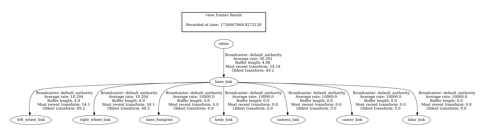

# Nomeer Robot

## Overview
The **Nomeer Robot** is a diff robot designed using ROS 2. This project includes two main packages:

1. **robot_description** - Handles the robot’s physical description and Gazebo, Rviz integration.
2. **teleop_twist_keyboard** - Enables manual control of the robot using keyboard inputs.

---

## Packages Details

### 1. **robot_description**
This package contains all necessary files to describe the Nomeer Robot and manage its simulation in Gazebo.

#### Directory Structure:
- **config/**: Contains configuration files for managing Gazebo bridge parameters.
- **launch/**: Includes launch files for starting the Gazebo world and robot description.
  - Example command to launch:
    ```bash
    ros2 launch robot_description robot.launch.py
    ```
- **models/**: Contains the Nomeer Robot’s SDF file.
- **worlds/**: Includes the `tugbot_warehouse.sdf` file for the simulation environment.
- **rviz/** :  Includes the rviz2 configration file.
- **CMakeLists.txt** and **package.xml**: Required files for building and defining package dependencies.

### 2. **teleop_twist_keyboard**
This package allows users to control the Nomeer Robot via keyboard input. It provides:
- A Python-based script to capture keyboard inputs and send velocity commands to the robot via /cmd_vel.

---

## Getting Started

### Prerequisites
Ensure you have the following installed:
- ROS 2 (Humble)
- Gazebo Harmonic

### Installation
1. Clone the repository to your workspace:
   ```bash
   git clone https://github.com/nomeera/nomeer_robot_ros2.git
   ```
2. Build the workspace:
   ```bash
   cd <workspace>
   colcon build --symlink-install --allow-overriding teleop_twist_keyboard
   ```
3. Source the workspace:
   ```bash
   source install/setup.bash
   ```

---

## Usage

### Launching the Robot in Gazebo
Run the following command to launch the robot in the warehouse simulation:
```bash
ros2 launch robot_description robot.launch.py
```

### Controlling the Robot
1. Open a new terminal and source the workspace.
2. Run the teleoperation script:
   ```bash
   ros2 run teleop_twist_keyboard teleop_twist_keyboard
   ```

Use the on-screen instructions to control the robot with your keyboard.

---


## nomeer_robot
#### Robot Frames


#### Rviz


#### Gazebo


## Future Plans
- Implement autonomous navigation.
---

## License
This project is licensed under the [Apache License](src/robot_description/LICENSE).

---

